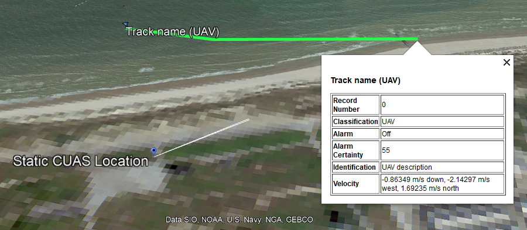
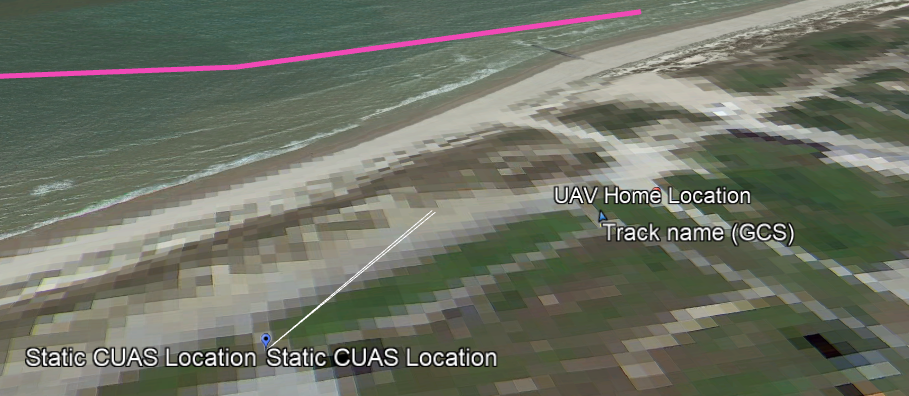
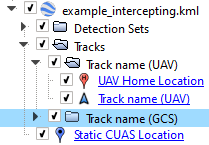

# Visualizing data
Data in the COURAGEOUS format can be visualized using Google Earth Pro
using [track2kml](https://grvc.us.es/courageous/).

**track2kml** is a commandline application that converts COURAGEOUS JSON files
into KML.

More information on track2kml can be found writting `track2kml --help`.

Executing track2kml on any of the following examples:
- [basic COURAGEOUS example](../res/example_basic.json)
- [intercepting C-UAS COURAGEOUS format example](../res/example_intercepting.json)
- [additional example](../res/test_data.json) 

Gives the following KML files:
- [basic COURAGEOUS example kml](../res/example_basic.kml) 
- [intercepting C-UAS COURAGEOUS format example kml](../res/example_intercepting.kml)
- [additional example kml](../res/test_data.kml) 

Which when viewed on Google Earth appears as such:

Basic example

Intercepting C-UAS example

KML file organization on Google Earth.

